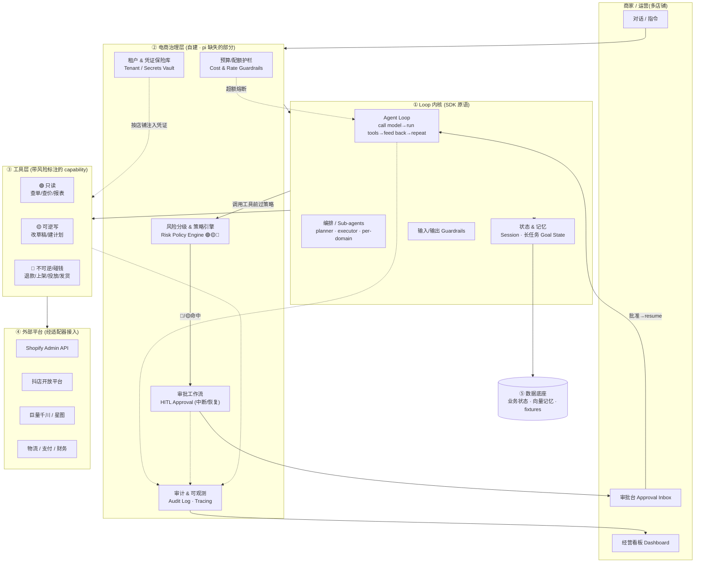
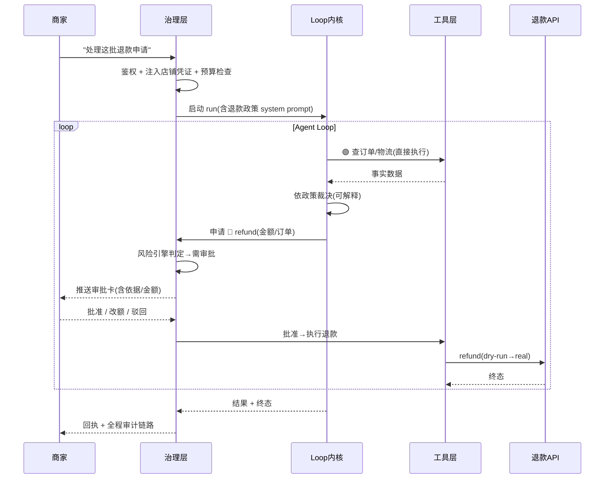

# 电商经营 Agent —— 架构设计

> 结论先行(见 `docs/research-agent-loops.md`):**用成熟 SDK 的 loop 原语做内核(OpenAI Agents SDK / Anthropic Agent SDK),借鉴 `earendil-works/pi` 的薄 loop + subagents + goal 编排思路,外面自建一层电商治理层(审批/多租户/审计)。** pi 本身"无内置权限/审批/多租户/审计",不直接作为生产底座。

---

## 1. 分层架构

---

## 2. 关键调用链(以"EC-13 退款裁决"为例)

---

## 3. 设计要点

| 层 | 职责 | 实现取舍 |
|---|---|---|
| ① Loop 内核 | 模型循环、工具调用、子agent、记忆 | 直接用 SDK 的 Runner/handoffs/sessions;长任务用 goal-state(借鉴 pi-goal) |
| ② 治理层(**自建,最关键**) | 多租户、凭证、风险分级、审批中断恢复、审计、预算护栏 | pi 完全没有;SDK 的 HITL/guardrails/tracing 提供一半,另一半(多租户/审计/凭证保险库)自建 |
| ③ 工具层 | 把平台 API 封装成**带风险等级**的 capability | 每个工具声明 `risk: 🟢/🟡/🔴` + `reversible` + `cost`;🔴 强制经审批 |
| ④ 适配器 | Shopify / 抖店 / 巨量 / 物流 统一接口 | 适配器模式;鉴权与限流隔离在治理层 |
| ⑤ 数据底座 | 业务状态、长任务状态、向量记忆、benchmark fixtures | 状态可中断恢复(对应 EC-28 长任务) |

**安全默认值**:工具默认 deny,显式声明风险等级才放行;🔴 永远 HITL;agent 永不持有长期凭证(凭证由治理层按店铺即时注入);所有写动作先 dry-run 入审计再执行。

详见 `docs/spec.md`。
